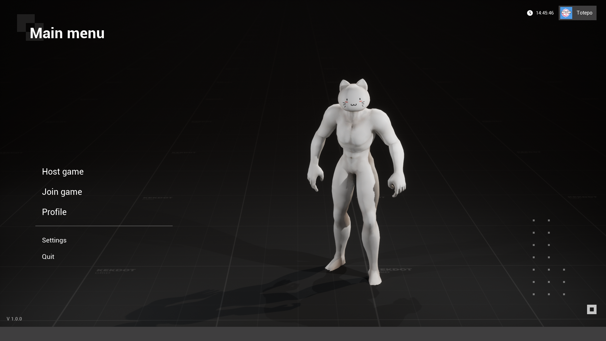
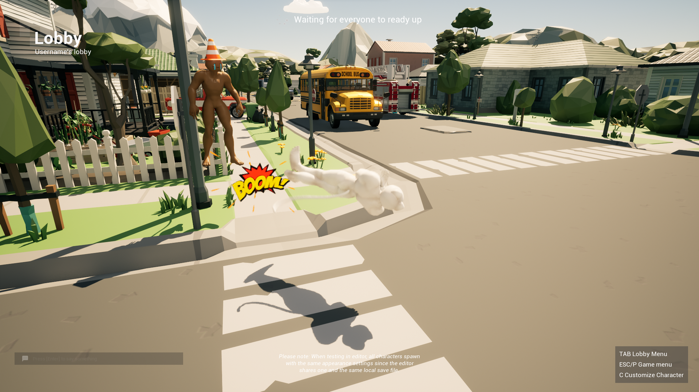
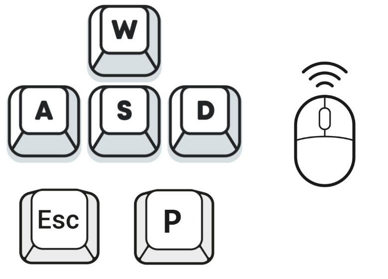
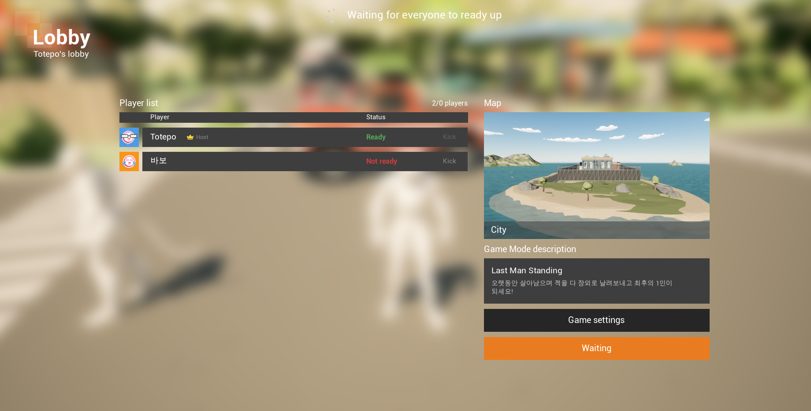
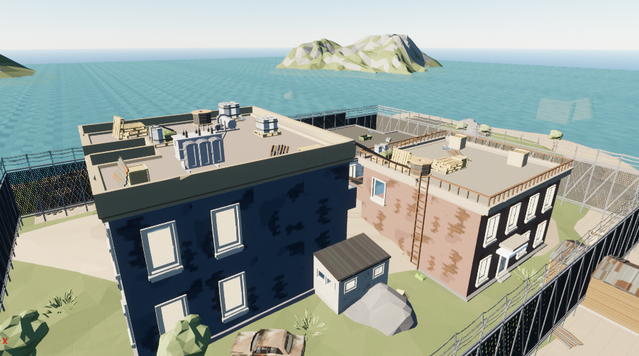
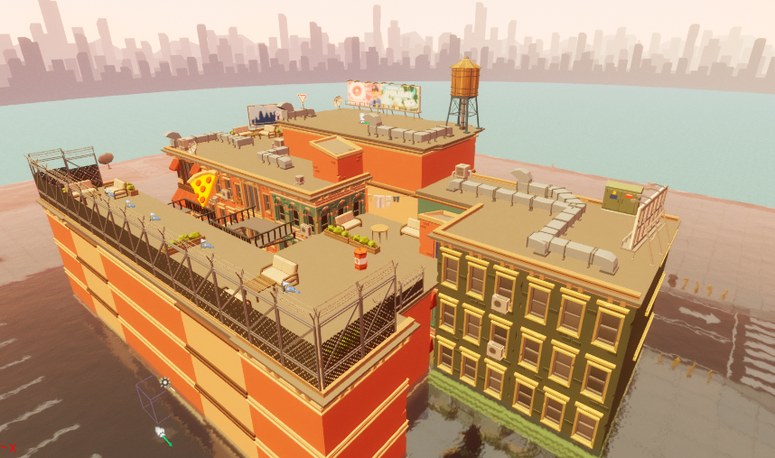

 # SinsaStudio

 

   ### Project Kitsch King  

 ### Kitch한 감성을 더해 컨셉과 플레이 모두 가볍고 톡톡 튀는 게임

## 목차
- [개요](#개요)
- [게임 설명](#게임설명)
- [게임 플레이 방법](#게임플레이방법)
## 개요
- 프로젝트 이름 : Project KitschKing 
- 프로젝트 기간 : 2023.09.14~2023.10.24
- 개발 엔진 : Unreal Engine 5.2.1
- 멤버 : 신사 스튜디오 (이승준, 엄성수, 신민철)

- ## 게임설명
- Kitch한 감성을 더해 컨셉과 플레이 모두 가볍고 톡톡 튀는 게임을 제작합니다
- 대전게임이지만 스트레스 없이, 탈락하더라도 지속적인 플레이가 가능하도록 기획합니다
- 우스꽝스러운 모습을 통해 원초적인 즐거움을 제공합니다
- 멀리 멀리 날아가서 탈락하는 모습을 통해 본인의 죽음에서 느끼는 카타르시스를 제공합니다
- 인게임 플레이 사진
  
    
  
  

- ## 게임플레이방법
- 캐릭터 조작 방법

이동 조작 : W S A D (상 하 좌 우)

일시정지 : P, ESC  

점프 : Space  

약 공격 : 마우스 좌클릭  

강 공격 : 마우스 우클릭  

- 로비에서 게임 시작

  
  
모든 플레이어가 레디 버튼을 누른뒤 서버장이 게임 시작을 진행합니다.
  
서버장이 게임의 모드 및 스테이지를 선택 가능합니다.
  
  
  
- 현재 가능한 스테이지 목록
  
 스테이지 - 시티  

 스테이지 - 옥상  
